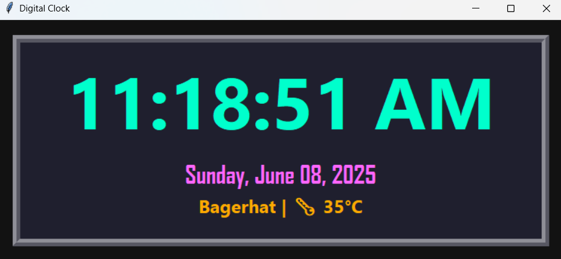

# 🕒Digital Clock with Temperature 🌡

This is a modern and aesthetic digital clock built with **Python Tkinter**, displaying:
- Current **time**
- **Date** and **day of the week**
- Real-time **temperature** using **OpenWeatherMap API**
- Styled with a clean **retro-digital look** on a dark background

---

## 📸 Preview



---

## 💻 Features

✅ Live time (12-hour format)\
✅ Day and date display\
✅ Real-time temperature from your city\
✅ Styled UI with glowing digital fonts\
✅ Responsive and always up-to-date

---

## 📦 Requirements

- Python 3.x
- Internet connection (for weather updates)
- Modules:
  ```bash
  pip install requests
  ```
## 🔗 Credits
- Weather API by OpenWeatherMap
- GUI by Python's built-in tkinter
- Project by Supan Roy 🎓

